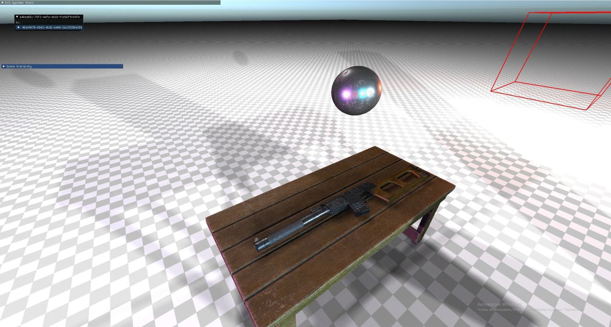

<h1 align="center"> A cross-platform Game Engine written in C++ </h1>

# <p align="center"> Features Overview </p>

-   **General:**
    - ECS.
    - 2D and 3D audio (OpenAL).
    - Parallel physics and transformations.
    - Octree with automatic subdivision.
    - Input (only PC).
    - Code generation using meta info and custom code generator language.
    - A set of classes for parallel and async computing.
    - UI (XML & CSS).
    - Plugins system.
    - Skeletons and skeletal animations with state blending.
    - Serde (serialization & deserialization) with support for polymorphic classes and data sharing.


-   **Graphics Rendering:**
    - Add-on for GLSL.
    - Forward PBR (Physically Based Rendering) using Cook-Torrance BRDF:
        - Objects.
        - Decals.
        - Terrains.
    - Terrains tesselation and vertex bump using displacement texture.
    - Atmosphere Scattering
    - Stochastic transparency
    - Volume postprocessing.
    - Entities picking.
    - Debug render.


-   **Assets Pipeline:**
    - Large formats support:
        - Vector graphics: SVG, TTF.
        - Raster graphics: JPG, PNG, DDS
        - External scenes formats such as: FBX, OBJ, GLTF, etc.
    - Creating and loading packages with assets.
    - Scenes saving and loading.

|                   **Octree**                    |                               **PBR**                                |
|:-----------------------------------------------:|:--------------------------------------------------------------------:|
|   |                          |
|               **Post-Processing**               |                             **Terrain**                              |
|       |  Terrain with physics |

### Platforms
- 🛠️ Cross Platform
    - ✔️ Windows
    - 🔨 MacOS
    - ✔️ Linux
    - ❌ Android
    - ❌ iOS
    - ❌ Web

## Contributors 🌟

- [Ilya (pfhgil)](https://github.com/pfhgil)
- [Nikita (8bitniksis)](https://github.com/8bitniksis)
- [Vlad (MisterChoose)](https://github.com/MisterChoose)

# Cloning the repository using console commands
### If you are cloning from github

```bash

cd <Path to your folder>

git clone --recurse-submodules -j8 https://github.com/Pixelfield-ru/SungearEngine

cd SungearEngine

git checkout main (or the latest tag: tags/<latest-tag>)
```

### If you downloaded release archive with sources

```bash

cd <Path to Sungear Engine>

git submodule update --init --recursive 
```

# CMake
## Variables and Flags
- Flag `SG_BUILD_TESTS`: enables building of test targets.
- Flag `SG_BUILD_ENRY`: enables building the entry executable with editor plugin loading.

## Presets
- `debug-host`: debug build for host platform (no optimizations, includes debug info).
- `release-host`: release build for host platform (with optimizations, no debug info).

# How to build and run
### Building Sungear Engine Core
1) Bootstrap vcpkg.
2) Set SUNGEAR_SOURCES_ROOT system variable to the root of your Sungear Engine installation.
3) Restart your PC (required for the environment variable).
4) Open IDE, select a CMake preset and load the root `CMakeLists.txt`.
5) After loading select the desired CMake target.
6) Build the selected target.
7) On Windows: copy `<output-dir>/Sources/SGCore/SGCore.dll` to the same directory as the `.exe` file you're running  
(for example: `<output-dir>/Tests/Terrain/SGTerrainTest.exe`).

### Building Sungear Engine Editor
1) Make sure you are using the **same CMake preset** for both Sungear Engine Core and Editor.
2) Open Editor project in IDE (editor is in `Plugins/SungearEngineEditor`).
3) Load CMake Project.
4) After loading choose target to build.
5) Build chosen target.

### Running with Editor
1) Build the `SungearEngine CMake target.
2) Run executable file: `<output-dir>/Sources/SGEntry/SungearEngine`

# License 📜
Distributed under the MIT License. See `LICENSE.txt` for more information.

# Contributing
## Reporting Issues

If you encounter any bugs when using Sungear Engine, please report them in the bug tracker. This is hosted at:

https://github.com/Pixelfield-ru/SungearEngine/issues

Make sure to first use the search function to see if the bug has already been reported.  
When filling out a bug report, make sure that you include as much information as possible to help the developers track down the issue, such as your version of SungearEngine, operating system, architecture, and any code and models that are necessary for the developers to reproduce the issue.
